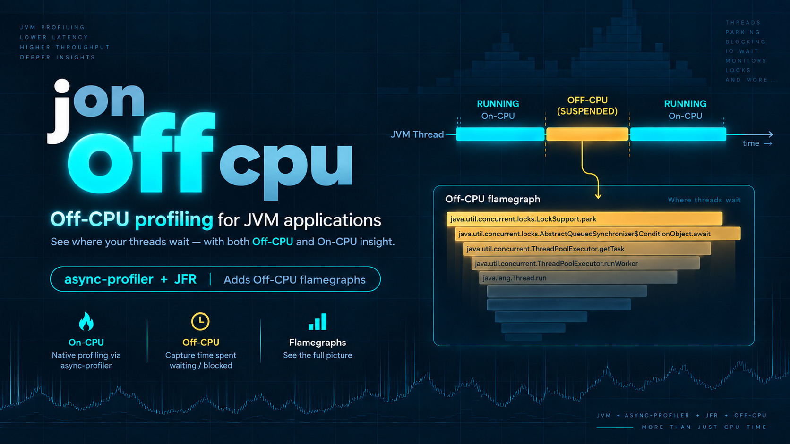
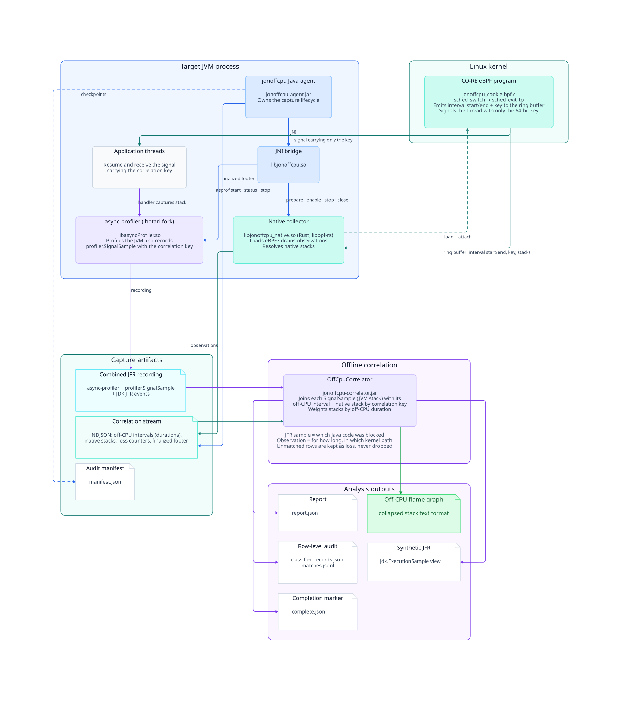

`jonoffcpu` is an off-CPU profiler for JVM applications on Linux. It measures how
long each thread was blocked, using the kernel scheduler as the source of truth,
and attributes that time to the Java stack that was waiting. The result is an
off-CPU flame graph whose widths are real durations, recorded alongside an
ordinary async-profiler JFR.

## Table of contents

- [The problem](#the-problem)
- [How it works](#how-it-works)
  - [Why two files?](#why-two-files)
  - [What the Java stack means](#what-the-java-stack-means)
- [Requirements](#requirements)
- [Quick start](#quick-start)
  - [1. Get the JARs](#1-get-the-jars)
  - [2. Record](#2-record)
  - [3. Correlate](#3-correlate)
  - [4. Render the flame graph](#4-render-the-flame-graph)
- [Configuration](#configuration)
  - [Agent options](#agent-options)
  - [Turning jonoffcpu off without removing it](#turning-jonoffcpu-off-without-removing-it)
  - [Correlator options](#correlator-options)
  - [Using the artifacts as libraries](#using-the-artifacts-as-libraries)
- [Building from source](#building-from-source)
- [Repository layout](#repository-layout)
- [License](#license)

## The problem

CPU profilers show where a program burns cycles. They say nothing about the
time a thread spends *not* running: waiting on a lock, a socket, a disk, a
`park()`, or simply a busy run queue. In a typical service that waiting time,
not CPU time, is what shows up as latency.

Existing tools each see half of the picture:

- **Kernel tools** such as BCC's [`offcputime`](https://github.com/iovisor/bcc/blob/master/tools/offcputime.py)
  know exactly when a thread went
  off CPU and when it came back, and can capture the kernel stack. They cannot
  walk JIT-compiled Java frames, so the Java side of the stack is missing or
  guessed from symbol maps.
- **JVM profilers** such as [async-profiler](https://github.com/async-profiler/async-profiler)
  walk Java stacks accurately, but
  their wall-clock mode is a timer-driven sampler. It sees that a thread was
  blocked at each tick, not how long the blocking interval actually lasted,
  and it cannot tell blocking from being runnable but descheduled.

`jonoffcpu` combines both: the kernel measures the interval, async-profiler
captures the Java stack, and a 64-bit key ties each measurement to its stack.

## How it works



1. A [CO-RE eBPF program](jonoffcpu-native/src/bpf/jonoffcpu_cookie.bpf.c)
   hooks `sched_switch` and `sched_exit_tp`. When a
   thread of the target JVM is switched out it records the timestamp; when the
   same thread is switched back in it has a complete off-CPU interval with its
   kernel and user native stacks.
2. Intervals that pass the configured duration bounds and sampling probability
   are written to a ring buffer together with a fresh 64-bit correlation key.
   The kernel then sends the resumed thread a signal whose payload is only that
   key.
3. The signal handler, in the bundled
   [`lhotari/async-profiler`](https://github.com/lhotari/async-profiler/tree/jonoffcpu-dev)
   fork, records a
   `profiler.SignalSample` event with the Java stack, the thread, and the key,
   in the same JFR recording that holds ordinary CPU, allocation, lock, and
   JDK events.
4. A [native collector](jonoffcpu-native/src/collector.rs) in the JVM process
   drains the ring buffer, resolves the
   native stacks, and appends each observation to an NDJSON correlation stream.
   The Java agent finalizes that stream with a footer that binds the JFR's size
   and SHA-256.
5. [`OffCpuCorrelator`](jonoffcpu-correlator/src/main/java/io/github/lhotari/jonoffcpu/offline/OffCpuCorrelator.java)
   runs offline. It joins each `SignalSample` to its
   observation by key, weights the Java stack by the kernel-measured duration,
   and writes a report, a collapsed-stack file, and a synthetic JFR.

### Why two files?

A `profiler.SignalSample` says only that a sampled interval ended. Everything
that turns it into a measurement lives in the correlation stream:

| | JFR `profiler.SignalSample` | NDJSON observation |
| --- | --- | --- |
| Correlation key | yes | yes |
| Java stack, captured after the thread resumed | yes | no |
| Interval start and end, i.e. the off-CPU duration | no | yes |
| Kernel and user native stacks at the scheduler endpoint | no | yes |
| Signal request result and kernel-side loss counters | no | yes |
| Footer binding the JFR's size and digest | no | yes |

Counting `SignalSample` events on their own would give a signal-frequency
profile, not an off-CPU profile: ten 1 ms parks and one 10 s socket read would
look identical. The JFR supplies *which Java code* was blocked; the stream
supplies *for how long* and *in which kernel path*. Observations that never
received a matching sample are kept and reported as loss, never dropped.

### What the Java stack means

The key proves that a sample and an observation describe the same interval. It
does not mean the two stacks were captured at the same instant. The native
stack belongs to the moment the thread was scheduled back in; the Java stack is
captured slightly later, when the signal is delivered. The report keeps the
kernel duration, the Java stack, and the delivery delay as separate values, and
`--max-handler-delay-ns` can reject samples that arrived too late to trust.

## Requirements

- 64-bit Linux with BTF, eBPF task storage, the `tp_btf/sched_exit_tp`
  tracepoint, and the `bpf_send_signal_task` helper. The agent checks the
  running kernel and fails closed if any of these is missing.
- Privileges to load and attach the BPF programs.
- Java 17 or newer for the agent; Java 21 or newer for the correlator.

The agent JAR is self-contained. It embeds the JNI bridge, the native
collector, and the patched async-profiler for Linux x86-64 and arm64, each
linked against both glibc and musl (Alpine), verifies them against a SHA-256
manifest, and extracts them to a private temporary directory at startup.
Nothing needs to be installed on the host. The agent picks the glibc or musl
bundle from the C library mapped into the running JVM; on an unusual host,
`-Dio.github.lhotari.jonoffcpu.nativeLibc=glibc` or `=musl` selects it
explicitly. If the temporary directory is mounted `noexec`, point
`-Dio.github.lhotari.jonoffcpu.nativeWorkDir` at an executable location.

## Quick start

### 1. Get the JARs

Download the latest
[GitHub Release](https://github.com/lhotari/jonoffcpu/releases), which
contains the three executable JARs:

```sh
gh release download -p '*.jar' -R lhotari/jonoffcpu
```

Pass a tag such as `v0.1.0` after `download` to pick a specific release
instead of the latest one.

| JAR | What it is | When you use it |
| --- | --- | --- |
| `jonoffcpu-agent.jar` | The Java agent. Bundles the eBPF collector, the JNI bridge, and the patched async-profiler for Linux x86-64 and arm64, and drives the whole capture lifecycle. | Attached to the JVM being profiled with `-javaagent`. |
| `jonoffcpu-correlator.jar` | The offline correlator CLI. Joins the combined JFR with the correlation NDJSON stream, verifies integrity, and writes derived outputs such as collapsed stacks and a synthetic JFR. | Run after the capture, on any machine with Java 21+. |
| `jfr-converter.jar` | async-profiler's [`jfrconv`](https://github.com/async-profiler/async-profiler/blob/master/docs/ConverterUsage.md), built from the pinned fork so that it understands the `profiler.Signal*` events and accepts `--units` to label the flame graph in microseconds. | Renders the correlator's collapsed stacks as an off-CPU flame graph whose widths are microseconds of off-CPU time. |

The examples below assume all three JARs are in the current directory.

### 2. Record

Create `jonoffcpu.yaml`:

```yaml
correlationOutput: /tmp/example.correlation.ndjson
asyncProfilerOptions: event=cpu,alloc=2m,jfrsync=profile,file=/tmp/example.jfr
sampleProbability: "0.010"
minOffCpuMicros: 1000
```

`asyncProfilerOptions` is passed to async-profiler unchanged, so any of its
[usual events](https://github.com/async-profiler/async-profiler/blob/master/docs/ProfilingModes.md)
can be recorded alongside the off-CPU samples. `minOffCpuMicros: 1000` skips
intervals shorter than 1 ms, which drops the run-queue and context-switch
noise that would otherwise dominate the sample count without contributing much
off-CPU time; drop it to keep every interval. Start the application:

```sh
java -javaagent:jonoffcpu-agent.jar=jonoffcpu.yaml -jar application.jar
```

The capture finishes when the JVM exits normally, or earlier if the application
calls `io.github.lhotari.jonoffcpu.agent.SignalCaptureAgent.stop()`. Abrupt
termination leaves visibly incomplete artifacts rather than a plausible-looking
partial result.

### 3. Correlate

```sh
java -jar jonoffcpu-correlator.jar \
  --source /tmp/example.correlation.ndjson \
  --jfr /tmp/example.jfr \
  --output /tmp/example-analysis
```

The output directory contains:

| File | Contents |
| --- | --- |
| `report.json` | Lifecycle, loss, classification, duration, and delivery-delay accounting |
| `offcpu-signal-delivery-stacks.collapsed` | Java stacks weighted in microseconds of off-CPU time |
| `offcpu-synthetic.jfr` | The same data as duration-quantized `jdk.ExecutionSample` events, for JFR viewers |
| `classified-records.jsonl`, `matches.jsonl` | Every row and every match, for auditing |
| `complete.json` | Written last, only after all inputs and outputs validate |

### 4. Render the flame graph

```sh
java -jar jfr-converter.jar --title "Off-CPU time" --units µs \
  /tmp/example-analysis/offcpu-signal-delivery-stacks.collapsed \
  /tmp/example-analysis/offcpu.html
```

Open `offcpu.html` in a browser. Frame widths are proportional to the total
off-CPU time observed under that Java stack. The collapsed weights are
microseconds of off-CPU time, and `--units µs` makes the flame graph say so
instead of counting "samples"; that option is a fork addition, so use the
provided `jfr-converter.jar` rather than a stock `jfrconv`. Add `--reverse` to see which
blocking calls dominate regardless of caller, or `-I`/`-X` regular expressions
to keep or drop stacks by frame. Any tool that reads the collapsed-stack
format, such as [`flamegraph.pl`](https://github.com/brendangregg/FlameGraph)
with `--countname=µs`, works on the same file.

The synthetic JFR opens directly in
[JDK Mission Control](https://jdk.java.net/jmc/) and other JFR viewers.

## Configuration

### Agent options

| Option | Meaning |
| --- | --- |
| `correlationOutput` | Required. Path of the correlation NDJSON stream. Must not exist yet. |
| `asyncProfilerOptions` | Required. async-profiler options, including one absolute `file=` path for the JFR. |
| `sampleProbability` | `0.000` through `1.000`; default `0.01`. `1` records every eligible interval. `0` switches off-CPU capture off entirely (see below). Quote the value to keep its exact spelling in the capture metadata. |
| `minOffCpuMicros` | Optional strict lower bound on the off-CPU duration, in microseconds. |
| `maxOffCpuMicros` | Optional strict upper bound on the off-CPU duration, in microseconds. |
| `signalDelivery` | `queued` (default) uses a dedicated real-time signal and never merges notifications. `coalescing` uses a standard signal and may merge them, trading lost samples for a bounded pending-signal queue. |
| `nativeStopTimeoutMillis` | Budget for detaching the eBPF source and draining the ring buffer at stop. Default 30000. |
| `deliveryGraceMillis` | Time allowed after detach for already-requested signals to arrive. Default 100. |
| `shutdownTimeoutMillis` | How long the JVM shutdown hook waits for the capture to finalize. Default 10000. |

Duration bounds and probability compose: an interval must satisfy both bounds
before the probability check is applied.

### Turning jonoffcpu off without removing it

Set `sampleProbability: "0"` to run plain async-profiler through the same
`-javaagent` line. The agent then loads no eBPF program, negotiates no signal,
and needs no BPF privileges; async-profiler is started with
`asyncProfilerOptions` exactly as given, so the JFR contains only its ordinary
events. The correlation path still receives a one-line stream whose
`captureFinalized` row has `state: "profilerOnly"`, so the correlator reports
that there is nothing to correlate instead of failing on a missing file. This
lets a deployment keep one configuration and flip off-CPU capture on or off.

The agent can also be started programmatically with
`SignalCaptureAgent.start(path)` or attached at runtime through its
`Agent-Class` entry point. See [jonoffcpu-agent/README.md](jonoffcpu-agent/README.md).

### Correlator options

| Option | Meaning |
| --- | --- |
| `--from`, `--to` | Select samples by JFR event time. Accepts ISO-8601 timestamps, epoch milliseconds, durations, or offsets from the recording start such as `30s` and `2m`. |
| `--max-handler-delay-ns` | Reject matches whose Java stack was captured more than this long after the interval ended. |
| `--from-ns`, `--to-ns` | Clip matched intervals to a window in the source monotonic clock. |
| `--format collapsed\|jfr` | Produce only one of the two derived outputs. |
| `--partial-jfr true` | Accept a JFR that another tool has cut. Source rows without a sample in the cut JFR are reported as expected omissions instead of loss. |
| `--partial true` | Inspect an interrupted capture. Exits with status 2 and never writes `complete.json` or the synthetic JFR. |

By default the correlator refuses a JFR whose size or SHA-256 differs from the
one recorded in the stream's footer. The full output, integrity, and weighting
contracts are in [jonoffcpu-correlator/OFFLINE.md](jonoffcpu-correlator/OFFLINE.md).

### Using the artifacts as libraries

```kotlin
dependencies {
    implementation("io.github.lhotari:jonoffcpu-agent:0.1.0")
    implementation("io.github.lhotari:jonoffcpu-correlator:0.1.0")
    implementation("io.github.lhotari:jonoffcpu-jfr-converter:0.1.0")
}
```

The correlator exposes
`OffCpuCorrelator.correlate(sourcePath, jfrPath, outputDirectory)` using JDK
types only. The published Gradle module metadata and POM point at the shaded,
self-contained JARs, so no further dependencies are needed.
`jonoffcpu-jfr-converter` is the converter from the pinned async-profiler fork
under the upstream `one.convert` and `one.jfr` packages, built for Java 21 and
licensed under Apache-2.0 like async-profiler itself.

## Building from source

Clone with the async-profiler submodule and build for the current host
architecture:

```sh
git clone --recurse-submodules https://github.com/lhotari/jonoffcpu.git
cd jonoffcpu
./gradlew :jonoffcpu-agent:check :jonoffcpu-correlator:check
```

The build needs [Amazon Corretto 25](https://aws.amazon.com/corretto/) and
Docker with [BuildKit](https://docs.docker.com/build/buildkit/); the native
libraries are compiled in a pinned container against the running kernel's BTF.
Pass `-PnativeArchitectures=all` to embed both Linux x86-64 and arm64 bundles,
or `x86_64` / `aarch64` to pick one. Each architecture has a glibc and a musl
flavour; `-PnativeLibcs` selects `musl` (the default), `glibc`, or `all`.
Releases embed all four bundles. The executable JARs land in
`jonoffcpu-agent/build/libs/` and `jonoffcpu-correlator/build/libs/`.

The converter is built from the same fork's `src/converter` sources by the
`jonoffcpu-jfr-converter` module:

```sh
./gradlew :jonoffcpu-jfr-converter:check
```

Every [CI run](https://github.com/lhotari/jonoffcpu/actions) also publishes
the three JARs as a `jonoffcpu-runnable-jars` workflow artifact:

```sh
gh run download <run-id> --repo lhotari/jonoffcpu \
  --name jonoffcpu-runnable-jars --dir jonoffcpu-runnable-jars
```

Formatting is enforced with [Spotless](https://github.com/diffplug/spotless)
(`./gradlew spotlessApply`). Release and
publishing steps are in [RELEASING.md](RELEASING.md); contributor conventions
are in [AGENTS.md](AGENTS.md).

## Repository layout

| Path | Purpose |
| --- | --- |
| [`jonoffcpu-agent/`](jonoffcpu-agent/) | Java agent: capture controller, JNI bridge, and native integration tests ([README](jonoffcpu-agent/README.md)) |
| [`jonoffcpu-native/`](jonoffcpu-native/) | Rust/[libbpf-rs](https://github.com/libbpf/libbpf-rs) collector, CO-RE eBPF programs, and privileged kernel proof tools ([README](jonoffcpu-native/README.md)) |
| [`jonoffcpu-correlator/`](jonoffcpu-correlator/) | Offline correlator: JFR reader and derived-output writers ([OFFLINE.md](jonoffcpu-correlator/OFFLINE.md)) |
| [`async-profiler/`](async-profiler/) | Submodule tracking the [`jonoffcpu-dev`](https://github.com/lhotari/async-profiler/tree/jonoffcpu-dev) branch of [`lhotari/async-profiler`](https://github.com/lhotari/async-profiler) |

## License

`jonoffcpu` is derived from Yuto Kawamura's MIT-licensed
[`kawamuray/jbm`](https://github.com/kawamuray/jbm) and continues under the
[MIT License](LICENSE). Third-party components bundled in the agent JAR retain
their own license and notice files.
