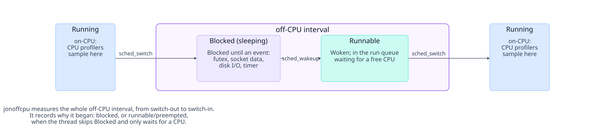
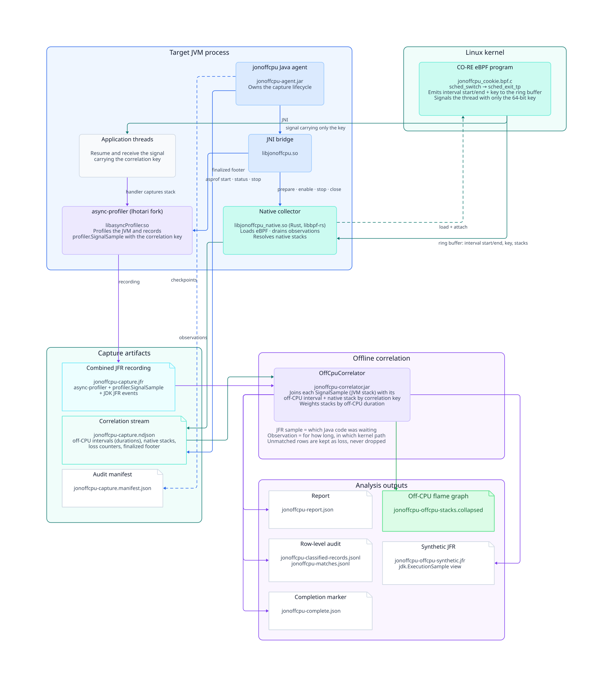

`jonoffcpu` is an off-CPU profiler for JVM applications on Linux. It measures how
long each thread was off-CPU, using the kernel scheduler as the source of truth,
and attributes that time to the Java stack that was waiting. The result is an
off-CPU flame graph whose widths are real durations, recorded alongside an
ordinary async-profiler JFR.

## Table of contents

- [What is off-CPU profiling?](#what-is-off-cpu-profiling)
- [The problem](#the-problem)
- [How it works](#how-it-works)
  - [Why two files?](#why-two-files)
  - [Files jonoffcpu writes](#files-jonoffcpu-writes)
  - [What the Java stack means](#what-the-java-stack-means)
  - [Why the thread left the CPU](#why-the-thread-left-the-cpu)
- [Requirements](#requirements)
  - [Kernel settings](#kernel-settings)
    - [Applying them to a VM's kernel](#applying-them-to-a-vms-kernel)
    - [Running the collector without root](#running-the-collector-without-root)
  - [Profiling in Docker](#profiling-in-docker)
    - [Docker Desktop on macOS and Windows](#docker-desktop-on-macos-and-windows)
- [Quick start](#quick-start)
  - [1. Get the JARs](#1-get-the-jars)
  - [2. Record](#2-record)
  - [3. Correlate](#3-correlate)
  - [4. Render the flame graph](#4-render-the-flame-graph)
  - [5. Slice and filter with the stack profile](#5-slice-and-filter-with-the-stack-profile)
- [Configuration](#configuration)
  - [Agent options](#agent-options)
  - [Choosing what to sample](#choosing-what-to-sample)
  - [Overhead and the observer effect](#overhead-and-the-observer-effect)
  - [Turning jonoffcpu off without removing it](#turning-jonoffcpu-off-without-removing-it)
  - [Correlator options](#correlator-options)
  - [Using the artifacts as libraries](#using-the-artifacts-as-libraries)
- [Building from source](#building-from-source)
- [Repository layout](#repository-layout)
- [License](#license)

## What is off-CPU profiling?

A CPU executes one thread at a time, and the Linux scheduler decides which.
Every hand-over is a context switch, visible to the kernel as the
`sched_switch` tracepoint: the outgoing thread is *switched out*, the incoming
one *switched in*. A thread is **on-CPU** from a switch-in to its next
switch-out and **off-CPU** the rest of the time. An off-CPU interval holds up
to two scheduler states. The thread is **sleeping** while it is not runnable
and waits for a wakeup — a futex, data on a socket, a disk read, a timer — and
it is **runnable** from the `sched_wakeup` that ends the sleep until a CPU is
free to switch it in. A thread that is preempted skips the sleep: it stays
runnable and only waits in the run queue. Off-CPU profiling records, for each
such interval, its exact duration and the code path that was executing when
the thread was switched out. CPU profilers sample only the on-CPU state; a
wall-clock sampler notices at each tick that a thread is off-CPU, but neither
how long the interval lasted nor whether the thread was sleeping or merely
queued.



The kernel sees the *mechanism* of a wait, never its *reason*. A thread never
blocks "on the database": with a synchronous JDBC driver it sleeps in a socket
read; with an asynchronous client, a connection pool or any `Future.get()` it
parks on a monitor or condition variable, a `futex`, while another thread
does the I/O. The mechanism and the duration are what the kernel can prove;
the reason lives in the stack of the code that called into the wait.

| What the code is doing | Where the Java thread waits | What the kernel sees |
| --- | --- | --- |
| Synchronous JDBC query | `SocketInputStream.read` (`NioSocketImpl`) | `read`/`recv` or `poll` on the socket, sleeping until data arrives |
| Async client, `CompletableFuture.get()`, connection pool | `LockSupport.park` | `futex` wait; another thread performs the I/O |
| Contended `synchronized` or `ReentrantLock` | monitor enter / `park` | `futex` wait |
| `Thread.sleep`, timed `wait` | `park` with a timeout | `futex` wait armed with a timer |

That split is why an off-CPU profile of a JVM needs both stacks: the kernel
stack and the interval come from the scheduler, the Java stack supplies the
cause, and `jonoffcpu` exists to pair each kernel-measured interval with a
Java stack.

This matters because in most services request latency is not CPU time. A
request that takes 200 ms may burn 5 ms of CPU and spend the rest sleeping on
a socket for a query result, parked on a future, or queued behind a busy CPU.
A CPU flame graph shows those 5 ms in detail and nothing about the other
195 ms. An off-CPU profile inverts that: it attributes the off-CPU time to the
stack that was waiting, so the 195 ms show up under the code that issued the
query, took the lock, or called the remote service. Rendered as an
[off-CPU flame graph](https://www.brendangregg.com/FlameGraphs/offcpuflamegraphs.html),
frame widths are total off-CPU duration instead of sample counts, and the
widest towers are the waits worth investigating. CPU and off-CPU profiles
together account for a thread's whole lifetime, which is what Brendan Gregg's
[Thread State Analysis](https://www.brendangregg.com/tsamethod.html) method
asks for: explain latency by the states that dominate it, not by the one state
a CPU profiler happens to see.

Off-CPU time is measured, not sampled: the scheduler records the exact moment
a thread left the CPU and the exact moment it returned, so every interval is a
real duration and the flame graph's widths are microseconds of off-CPU time.
`jonoffcpu` measures the whole interval, from switch-out to switch-in, so
run-queue delay under CPU contention is included alongside sleeping. It also
records *why* the thread left the CPU — it blocked, or it was still runnable —
and by default records only the blocked intervals; see
[Why the thread left the CPU](#why-the-thread-left-the-cpu).

Further reading:

- [Linux tracepoints](https://www.kernel.org/doc/html/latest/trace/events.html)
  and [`sched(7)`](https://man7.org/linux/man-pages/man7/sched.7.html): the
  `sched_switch` and `sched_wakeup` events this definition rests on, and the
  scheduler's view of task states.
- [Off-CPU Analysis](https://www.brendangregg.com/offcpuanalysis.html): the
  method, its overheads, and how it complements CPU profiling.
- [Off-CPU Flame Graphs](https://www.brendangregg.com/FlameGraphs/offcpuflamegraphs.html):
  reading and generating flame graphs whose widths are off-CPU durations.
- [The TSA Method](https://www.brendangregg.com/tsamethod.html): thread state
  analysis as a systematic way to account for all of a thread's time.

## The problem

CPU profilers show where a program burns cycles. They say nothing about the
time a thread spends *not* running: waiting on a lock, a socket, a disk, a
`park()`, or simply a busy run queue. In a typical service that waiting time,
not CPU time, is what shows up as latency.

Existing tools each see half of the picture:

- **Kernel tools** such as BCC's [`offcputime`](https://github.com/iovisor/bcc/blob/master/tools/offcputime.py)
  know exactly when a thread went
  off CPU and when it came back, and can capture the kernel stack. They cannot
  walk JIT-compiled Java frames, so the Java side of the stack is missing or
  guessed from symbol maps.
- **JVM profilers** such as [async-profiler](https://github.com/async-profiler/async-profiler)
  walk Java stacks accurately, but
  their wall-clock mode is a timer-driven sampler. It sees that a thread was
  off-CPU at each tick, not how long the interval actually lasted, and it
  cannot tell sleeping from being runnable but descheduled.

`jonoffcpu` combines both: the kernel measures the interval, async-profiler
captures the Java stack, and a 64-bit key ties each measurement to its stack.

## How it works



1. A [CO-RE eBPF program](jonoffcpu-native/src/bpf/jonoffcpu_cookie.bpf.c)
   hooks `sched_switch` and `sched_exit_tp`. When a
   thread of the target JVM is switched out it records the timestamp and why
   the scheduler took it off the CPU; when the same thread is switched back in
   it has a complete off-CPU interval with its kernel and user native stacks.
2. Intervals of the selected switch-out reasons that pass the configured
   duration bounds and admission policy
   are written to a ring buffer together with a fresh 64-bit correlation key.
   The kernel then sends the resumed thread a signal whose payload is only that
   key.
3. The signal handler, in the bundled
   [`lhotari/async-profiler`](https://github.com/lhotari/async-profiler/tree/jonoffcpu-dev)
   fork, records a
   `profiler.SignalSample` event with the Java stack, the thread, and the key,
   in the same JFR recording that holds ordinary CPU, allocation, lock, and
   JDK events.
4. A [native collector](jonoffcpu-native/src/collector.rs) in the JVM process
   drains the ring buffer, resolves the
   native stacks, and appends each observation to the correlation stream.
   The Java agent finalizes that stream with a footer that binds the JFR's size
   and SHA-256.
5. [`OffCpuCorrelator`](jonoffcpu-correlator/src/main/java/io/github/lhotari/jonoffcpu/offline/OffCpuCorrelator.java)
   runs offline. It joins each `SignalSample` to its
   observation by key, weights the Java stack by the kernel-measured duration,
   and writes a report, a collapsed-stack file, a stack profile from which
   other slices can be rendered later, and a synthetic JFR.

### Why two files?

A `profiler.SignalSample` says only that a sampled interval ended. Everything
that turns it into a measurement lives in the correlation stream:

| | JFR `profiler.SignalSample` | stream observation |
| --- | --- | --- |
| Correlation key | yes | yes |
| Java stack, captured after the thread resumed | yes | no |
| Interval start and end, i.e. the off-CPU duration | no | yes |
| Kernel and user native stacks at the scheduler endpoint | no | yes |
| Signal request result and kernel-side loss counters | no | yes |
| Footer binding the JFR's size and digest | no | yes |

Counting `SignalSample` events on their own would give a signal-frequency
profile, not an off-CPU profile: ten 1 ms parks and one 10 s socket read would
look identical. The JFR supplies *which Java code* was waiting; the stream
supplies *for how long* and *in which kernel path*. Observations that never
received a matching sample are kept and reported as loss, never dropped.

### Files jonoffcpu writes

Every file the agent or the correlator creates carries the `jonoffcpu` name,
so a capture is recognisable in a shared directory or a support bundle. The
capture files take their stem from `correlationOutput`; the analysis files are
named by the correlator.

Capture, written by the agent next to `correlationOutput` (the examples assume
`correlationOutput: /tmp/jonoffcpu-capture.pb`):

| File | Contents | Name comes from |
| --- | --- | --- |
| `jonoffcpu-capture.pb` | The correlation stream: `captureStart`, one `stack` per distinct native stack, one `observation` per recorded off-CPU interval referencing them by id, `captureEnd`, and the `captureFinalized` footer that binds the JFR's size and SHA-256. Length-delimited protobuf, defined by [`docs/schema/jonoffcpu-capture.proto`](docs/schema/jonoffcpu-capture.proto); `java -jar jonoffcpu-correlator.jar --dump --source <file>` prints it as NDJSON | `correlationOutput` |
| `jonoffcpu-capture.manifest.json` | Audit manifest: configuration, resolved sampling policy, artifact paths, lifecycle state, completion flag | the stem of `correlationOutput` + `.manifest.json` |
| `jonoffcpu-capture.jfr` | The combined async-profiler recording, including `profiler.SignalSample` events | the `file=` option in `asyncProfilerOptions`; defaults to the stem of `correlationOutput` + `.jfr` |

Analysis, written by the correlator into `--output`:

| File | Contents |
| --- | --- |
| `jonoffcpu-report.json` | Lifecycle, loss, classification, duration, delivery-delay accounting, and the optional population estimate |
| `jonoffcpu-offcpu-stacks.collapsed` | Java stacks weighted in microseconds of off-CPU time, for flame graphs. Every recorded interval; when the capture mixes switch-out reasons, each line starts with an `[offcpu: <reason>]` frame |
| `jonoffcpu-offcpu-stacks-<reason>.collapsed` | The same, one file per switch-out reason, written only when the capture mixes reasons |
| `jonoffcpu-offcpu-profile.pb` | The stack profile: every distinct Java, kernel and user stack once, with interval counts and observed and estimated durations per stack, reason and thread. Any other collapsed slice is rendered from it without re-correlating; see [5. Slice and filter with the stack profile](#5-slice-and-filter-with-the-stack-profile). Defined by [`docs/schema/jonoffcpu-profile.proto`](docs/schema/jonoffcpu-profile.proto) |
| `jonoffcpu-offcpu-synthetic.jfr` | The same data as duration-quantized `jdk.ExecutionSample` events, for JFR viewers |
| `jonoffcpu-classified-records.jsonl` | Every source row and every JFR sample with its classification, for auditing. Written only with `--audit full`; **not written by default** |
| `jonoffcpu-matches.jsonl` | Every exact-cookie match with its clipped interval and delivery delay. Written by the default `--audit matches`, and by `--audit full` |
| `jonoffcpu-complete.json` | Written last, only after all inputs and outputs validate. Never written when the run narrowed its window (see `--on-limit` below) |

`--audit` defaults to `matches`, so `jonoffcpu-classified-records.jsonl` is no
longer written unless `--audit full` is passed — this is a backward-incompatible
change from earlier releases, which always wrote both audit files. Anything that
reads `jonoffcpu-classified-records.jsonl` needs `--audit full` added to its
correlator invocation. The library API (`OffCpuCorrelator.correlate`) is
unaffected and keeps writing both.

When the retained-bytes budget is reached, `--on-limit degrade` (the default)
trades away thinner outputs before it trades away coverage: it coarsens the
synthetic JFR quantum, drops the audit outputs, then thins the source with an
exact inverse-probability reweighting, and only as a last resort narrows the
analysis window. Thinning still analyses the whole requested window — with
ordinary output names, `jonoffcpu-complete.json`, and exit status 0 — because it
is a stated estimator over what was asked for. Narrowing the window instead
analyses a shorter window *completely*, and is labelled as visibly incomplete:
`INCOMPLETE-jonoffcpu-*` names, a `jonoffcpu-narrowed.json` marker instead of
`jonoffcpu-complete.json`, and exit status 2. See
[jonoffcpu-correlator/OFFLINE.md's **Degradation**](jonoffcpu-correlator/OFFLINE.md#degradation)
for the full ladder and the report's `degradation` object.

`--partial true` inspects an interrupted capture and writes a visibly different
set instead: `INCOMPLETE-jonoffcpu-report.json`,
`INCOMPLETE-jonoffcpu-classified-records.jsonl`, `INCOMPLETE-jonoffcpu-pairs.jsonl`,
optionally `INCOMPLETE-jonoffcpu-offcpu-stacks.collapsed`, and the marker
`jonoffcpu-partial.json`. It never writes `jonoffcpu-complete.json`.

### Why the thread left the CPU

`sched_switch` tells the kernel why the outgoing thread is leaving the CPU,
and `jonoffcpu` records it on every interval:

| Reason | What the scheduler saw | Typical cause |
| --- | --- | --- |
| `blocked` | The thread left in a waiting state (`TASK_INTERRUPTIBLE`, `TASK_UNINTERRUPTIBLE`, …) | A futex (lock, `park`, `Future.get()`), a socket or `epoll` wait, a timer, disk I/O, a page fault |
| `runnable` | The thread left at an ordinary scheduling point while still `TASK_RUNNING` | **Preemption of running Java code**: a thread preempted by the scheduler tick is switched out on its return to user mode, where the kernel sees an ordinary `schedule()` — and `sched_yield` |
| `preempted` | The kernel preempted the thread at a preemption point inside the kernel | Preemption while the thread was in a system call or a page fault |

`runnable` and `preempted` are both time spent *waiting for a CPU*: a stack
that is wide under them is where execution stopped, not what the thread was
waiting for, and the investigation belongs to CPU saturation, cgroup
throttling, thread-pool sizing or IRQ load rather than to that code. Measured
on a 16-CPU 7.1 kernel, more spinning threads than CPUs came back 2,861
`runnable` against 2 `preempted`, so read the two together.

The reason describes the *switch-out*, not a split of the interval's time. A
`blocked` interval runs until the thread is switched back in, so it also
contains the run-queue delay between its wakeup and its next turn on a CPU;
the report says so, and splitting the two with `sched_wakeup` is future work.

The kernel keeps the original value (`prev_task_state`) and the `preempt` flag
next to the reason, and the agent and the correlator recompute the reason from
them for every row. The kernel also counts every switch-out by reason before
filtering, so even a blocked-only capture reports how often its threads were
denied the CPU; the report's `offCpuReasons` object carries those counts next
to the matched intervals of each selected reason.

### What the Java stack means

The key proves that a sample and an observation describe the same interval. It
does not mean the two stacks were captured at the same instant. The native
stack belongs to the moment the thread was scheduled back in; the Java stack is
captured slightly later, when the signal is delivered. The report keeps the
kernel duration, the Java stack, and the delivery delay as separate values, and
`--max-handler-delay-ns` can reject samples that arrived too late to trust.

## Requirements

- 64-bit Linux with BTF, eBPF task storage, the `tp_btf/sched_exit_tp`
  tracepoint, and the `bpf_send_signal_task` helper. The agent checks the
  running kernel and fails closed if any of these is missing.
- Privileges to load and attach the BPF programs: `CAP_BPF` and
  `CAP_PERFMON`, or root. See [Kernel settings](#kernel-settings) for the
  sysctls that async-profiler needs alongside them.
- Java 17 or newer for the agent; Java 21 or newer for the correlator.
- On Java 24 and newer, add `--sun-misc-unsafe-memory-access=allow` to the JVM
  being profiled and to the correlator. The bundled protobuf codec that reads
  and writes the capture stream uses `sun.misc.Unsafe`, which the JDK reports
  once per JVM as a terminally deprecated call; the flag silences that warning
  and changes nothing else.

The agent JAR is self-contained. It embeds the JNI bridge, the native
collector, and the patched async-profiler for Linux x86-64 and arm64, each
linked against both glibc and musl (Alpine), verifies them against a SHA-256
manifest, and extracts them to a private temporary directory at startup.
Nothing needs to be installed on the host. The agent picks the glibc or musl
bundle from the C library mapped into the running JVM; on an unusual host,
`-Dio.github.lhotari.jonoffcpu.nativeLibc=glibc` or `=musl` selects it
explicitly. If the temporary directory is mounted `noexec`, point
`-Dio.github.lhotari.jonoffcpu.nativeWorkDir` at an executable location.

### Kernel settings

jonoffcpu's own eBPF collector needs privileges (`CAP_BPF` and `CAP_PERFMON`, or
root), and nothing else. The settings below are about the *other* half of the
capture: async-profiler runs inside the JVM, usually unprivileged, and the
kernel restricts by default what an unprivileged process may observe. Without
them the capture still completes, but parts of it are degraded — typically
missing kernel frames, truncated native stacks, or no `cpu` event at all.

| Setting | Suggested value | Why |
| --- | --- | --- |
| `kernel.perf_event_paranoid` | `1` | The gate on `perf_event_open`. The common default `2` lets an unprivileged process measure only its own user space, so async-profiler's `cpu` engine cannot sample kernel stacks; `>= 2` is also the usual reason `perf_event_open` fails outright and the profiler falls back or errors. `1` allows per-process profiling including kernel stacks. `CAP_PERFMON` bypasses the check. |
| `kernel.kptr_restrict` | `0` | Kernel symbol addresses in `/proc/kallsyms` read back as zeros unless the reader has `CAP_SYSLOG` (`1`), or for everyone (`2`). Both async-profiler and jonoffcpu's collector symbolize kernel frames from that file, so with addresses hidden the kernel part of a stack stays as raw addresses. |
| `kernel.perf_event_max_stack` | `1024` | The maximum call-chain depth `perf_events` records, `127` by default, which silently truncates deep JVM native stacks. Raising it only affects async-profiler: jonoffcpu's BPF stack map has a fixed depth of 127. Do not lower it below 127 — the collector's stack map cannot be created if the sysctl is smaller than the map's depth. |
| `kernel.perf_event_mlock_kb` | `2048` | async-profiler mmaps an 8 KB perf buffer per thread, bounded by `ulimit -l` plus this value times the number of CPUs. On a thread-heavy application the default `516` runs out and native stacks are dropped for the remaining threads. |

Apply them for the current boot:

```sh
sudo sysctl -w kernel.perf_event_paranoid=1
sudo sysctl -w kernel.kptr_restrict=0
sudo sysctl -w kernel.perf_event_max_stack=1024
sudo sysctl -w kernel.perf_event_mlock_kb=2048
```

Use `sysctl` rather than `sudo echo 1 > /proc/sys/…`: the redirection is
performed by the calling shell, which is still unprivileged, so that form fails
with "Permission denied" before `sudo` runs. `sudo tee`
(`echo 1 | sudo tee /proc/sys/kernel/perf_event_paranoid`) works as well. To
make the values persist across reboots, put them in
`/etc/sysctl.d/99-jonoffcpu.conf` as `key = value` lines.

In a container, these are host-wide kernel settings: `kernel.perf_event_*` and
`kernel.kptr_restrict` are not namespaced, so set them on the host, not inside
the container. For the same reason `docker run --sysctl` refuses them, since it
accepts only namespaced keys.

#### Applying them to a VM's kernel

With Docker Desktop on macOS or Windows, and with Colima, Lima or any other
Linux VM, the kernel that matters is the VM's: `sysctl` on the workstation
changes nothing that the containers can see. Write the values from a privileged
container, which shares the VM kernel's `/proc/sys`:

```sh
docker run --rm --privileged alpine sh -c '
  echo 1    > /proc/sys/kernel/perf_event_paranoid
  echo 0    > /proc/sys/kernel/kptr_restrict
  echo 1024 > /proc/sys/kernel/perf_event_max_stack
  echo 2048 > /proc/sys/kernel/perf_event_mlock_kb
  echo 0    > /proc/sys/kernel/unprivileged_bpf_disabled'
```

`--privileged` is what makes `/proc/sys` writable; without it the container gets
it read-only, and adding `--cap-add SYS_ADMIN` or
`--security-opt seccomp=unconfined` changes nothing that `--privileged` has not
already granted. The writes affect the whole VM and last until it restarts, so
this is a per-boot step rather than a one-time setup. The commands are listed
one per line on purpose: the last one fails with `EPERM` on a kernel where
`unprivileged_bpf_disabled` already reads `1`, and chaining them with `&&` would
hide the earlier successes behind that failure. It is also the one line that is
optional — see [Running the collector without root](#running-the-collector-without-root).

#### Running the collector without root

`kernel.unprivileged_bpf_disabled = 0` re-enables the `bpf()` syscall for
callers that hold no BPF capability:

```sh
sudo sysctl -w kernel.unprivileged_bpf_disabled=0
```

It does **not** make jonoffcpu work unprivileged. Unprivileged `bpf()` only ever
permitted socket-filter programs, while the collector loads tracepoint programs
and uses helpers that require `CAP_BPF` plus `CAP_PERFMON`; with those
capabilities the sysctl is not consulted at all. It is worth setting only where
something else in the toolchain trips over the syscall gate. Note that the value
`1` is a one-way latch: once the sysctl reads `1`, the kernel refuses to change
it until the next boot, so a host that has disabled unprivileged BPF that way
has to be rebooted (distributions that default to `2` can be changed at
runtime).

### Profiling in Docker

The agent and the collector both run inside the container with the JVM: the
agent extracts the collector from its JAR and starts it as a child process, and
the eBPF program resolves thread ids inside the target's own PID namespace. So
the container is profiled as it is: neither `--pid=host` nor `--net=host` is
needed, and no kernel headers have to be mounted, because the collector is CO-RE
and reads the kernel's own BTF. General-purpose BPF toolbox images ask for all
of these because they trace the whole host from outside, and because BCC
compiles its programs against kernel headers at runtime. The only case that
needs `--pid=host`, or `--pid=container:<id>`, is running the standalone
collector against a target in another container, which is what this
repository's proof scripts do.

| The container needs | How | Why |
| --- | --- | --- |
| BPF and perf capabilities | `--cap-add BPF --cap-add PERFMON` | Loading and attaching the programs is `bpf()`; both scheduler hooks are BTF raw tracepoints attached through BPF links. Docker's default seccomp profile permits it once the matching capabilities are present, so `--security-opt seccomp=unconfined` is not required. |
| `tracefs` on `/sys/kernel/tracing` | a `local` volume, below | Earlier releases attached `sched_switch` as a classic tracepoint, for which libbpf reads the numeric id from `events/sched/sched_switch/id`. Both hooks are now BTF raw tracepoints, and on a Linux host the packaged smoke passes without `tracefs` mounted, both `--privileged` and with only `--cap-add BPF --cap-add PERFMON --cap-add SYSLOG`. Keep the mount on Docker Desktop, where that has not been verified. |
| Kernel symbols | `kernel.kptr_restrict=0` on the host, or `--cap-add SYSLOG` | Otherwise `/proc/kallsyms` reads back as zeros and kernel frames stay raw addresses. |
| An executable temporary directory | `-Dio.github.lhotari.jonoffcpu.nativeWorkDir=…` if `/tmp` is `noexec` | The agent extracts the native bundle and executes it. |

BTF needs nothing: `/sys/kernel/btf/vmlinux` is part of the container's own
`sysfs` and is readable already.

Mount `tracefs` with a `local` volume, which passes its options straight to
`mount`:

```sh
docker volume create --driver local \
  --opt type=tracefs --opt device=tracefs --opt o=ro tracefs

docker run --rm \
  --cap-add BPF --cap-add PERFMON \
  -v tracefs:/sys/kernel/tracing \
  your-image \
  java -javaagent:jonoffcpu-agent.jar=jonoffcpu.yaml -jar application.jar
```

Read-only is enough, because nothing writes to it. The equivalent in Compose:

```yaml
volumes:
  tracefs:
    driver: local
    driver_opts: { type: tracefs, device: tracefs, o: ro }
services:
  app:
    cap_add: [BPF, PERFMON]
    volumes:
      - tracefs:/sys/kernel/tracing
```

Docker performs this mount itself, before the container starts, so it works in
an unprivileged container and needs nothing bind-mounted from the host. Bind
mounting the host's `/sys/kernel/tracing` is equivalent where the host is Linux.
Mounting `tracefs` from inside the container instead requires `--privileged`:
`/sys` is mounted read-only and locked, so `--cap-add SYS_ADMIN` alone cannot do
it. If a hardened runtime refuses the capability-based setup, `--privileged` is
the blunt alternative; it is what this repository's own proof scripts use.

#### Docker Desktop on macOS and Windows

There the containers run in a Linux VM, and the kernel is the VM's, not the
host operating system's. Bind mounting `/sys/kernel/tracing` cannot work, since
that path would be resolved on macOS or Windows; the `local` volume above does
work, because Docker mounts it inside the VM. The sysctls are the VM's too, and
are set as described in
[Applying them to a VM's kernel](#applying-them-to-a-vms-kernel).

The kernel features are the real question. jonoffcpu needs BTF, eBPF task
storage, `bpf_send_signal_task`, and the `tp_btf/sched_exit_tp` tracepoint,
which is recent enough that Docker Desktop's LinuxKit kernel and a stock WSL2
kernel may not have it; the agent then fails closed rather than producing
degraded data. Check the VM you have before going further:

```sh
docker run --rm --privileged alpine sh -c '
  uname -r
  ls -l /sys/kernel/btf/vmlinux
  mount -t tracefs tracefs /sys/kernel/tracing &&
    cat /sys/kernel/tracing/events/sched/sched_switch/id
  grep -ac btf_trace_sched_exit_tp /sys/kernel/btf/vmlinux'
```

All four must succeed, the last one printing a non-zero count. If they do not,
supply a newer kernel — on Windows through `kernel=` in `.wslconfig`, on macOS
through a VM manager that lets you choose the image — or profile on a Linux
host. Either way, only a JVM running inside that Linux VM can be profiled; a
JVM running natively on macOS or Windows is invisible to it.

## Quick start

### 1. Get the JARs

Download the latest
[GitHub Release](https://github.com/lhotari/jonoffcpu/releases), which
contains the three JARs:

```sh
gh release download -p '*.jar' -R lhotari/jonoffcpu
```

Pass a tag such as `v0.3.0` after `download` to pick a specific release
instead of the latest one.

| JAR | What it is | When you use it |
| --- | --- | --- |
| `jonoffcpu-agent.jar` | The Java agent. Bundles the eBPF collector, the JNI bridge, and the patched async-profiler for Linux x86-64 and arm64, and drives the whole capture lifecycle. | Attached to the JVM being profiled with `-javaagent`. |
| `jonoffcpu-correlator.jar` | The offline correlator CLI. Joins the combined JFR with the correlation stream, verifies integrity, and writes derived outputs such as collapsed stacks and a synthetic JFR. | Run after the capture, on any machine with Java 21+. |
| `jfr-converter.jar` | async-profiler's [`jfrconv`](https://github.com/async-profiler/async-profiler/blob/master/docs/ConverterUsage.md), built from the pinned fork so that it understands the `profiler.Signal*` events and accepts `--units` to label the flame graph in microseconds. | Renders the correlator's collapsed stacks as an off-CPU flame graph whose widths are microseconds of off-CPU time. |

The examples below assume all three JARs are in the current directory.

### 2. Record

Create `jonoffcpu.yaml`:

```yaml
correlationOutput: /tmp/jonoffcpu-capture.pb
asyncProfilerOptions: event=cpu,alloc=2m,jfrsync=profile,file=/tmp/jonoffcpu-capture.jfr
sampling:
  minOffCpuMicros: 100
  admission:
    policy: proportional
    recordAllAboveMicros: 10000
```

`asyncProfilerOptions` is passed to async-profiler unchanged, so any of its
[usual events](https://github.com/async-profiler/async-profiler/blob/master/docs/ProfilingModes.md)
can be recorded alongside the off-CPU samples. `recordAllAboveMicros: 10000`
records every wait of 10 ms or longer and samples shorter ones in proportion
to their length, so long waits are never missed and the run-queue noise does
not swamp the capture; `minOffCpuMicros: 100` drops the sub-100 µs context
switches entirely. See [Choosing what to sample](#choosing-what-to-sample).
Start the application:

```sh
java -javaagent:jonoffcpu-agent.jar=jonoffcpu.yaml -jar application.jar
```

The capture finishes when the JVM exits normally, or earlier if the application
calls `io.github.lhotari.jonoffcpu.agent.SignalCaptureAgent.stop()`. Abrupt
termination leaves visibly incomplete artifacts rather than a plausible-looking
partial result.

### 3. Correlate

```sh
java -jar jonoffcpu-correlator.jar \
  --source /tmp/jonoffcpu-capture.pb \
  --jfr /tmp/jonoffcpu-capture.jfr \
  --output /tmp/jonoffcpu-analysis
```

The output directory then holds `jonoffcpu-report.json`,
`jonoffcpu-offcpu-stacks.collapsed`, `jonoffcpu-offcpu-synthetic.jfr`, the
row-level audit files, and `jonoffcpu-complete.json` as the last file written;
[Files jonoffcpu writes](#files-jonoffcpu-writes) describes each one.

### 4. Render the flame graph

```sh
java -jar jfr-converter.jar --title "Off-CPU time" --units µs \
  /tmp/jonoffcpu-analysis/jonoffcpu-offcpu-stacks.collapsed \
  /tmp/jonoffcpu-analysis/offcpu.html
```

Open `offcpu.html` in a browser. Frame widths are proportional to the total
off-CPU time observed under that Java stack. The collapsed weights are
microseconds of off-CPU time, and `--units µs` makes the flame graph say so
instead of counting "samples"; that option is a fork addition, so use the
provided `jfr-converter.jar` rather than a stock `jfrconv`. Add `--reverse` to see which
blocking calls dominate regardless of caller. To keep or drop stacks by frame,
render the slice from the stack profile with `--include`/`--exclude` (step 5),
which also matches frames the graph does not show. Any tool that reads the collapsed-stack
format, such as [`flamegraph.pl`](https://github.com/brendangregg/FlameGraph)
with `--countname=µs`, works on the same file.

The synthetic JFR opens directly in
[JDK Mission Control](https://jdk.java.net/jmc/) and other JFR viewers.

### 5. Slice and filter with the stack profile

`jonoffcpu-offcpu-profile.pb` holds every distinct stack once with its
counters, so any other collapsed file is a sub-second projection of it rather
than a new correlation (913 KB and 0.3 s for a capture that takes a minute to
correlate):

```sh
# Time spent waiting for a CPU, whatever the Java code was doing
java -jar jonoffcpu-correlator.jar stacks \
  --profile /tmp/jonoffcpu-analysis/jonoffcpu-offcpu-profile.pb \
  --reason runnable,preempted --output cpu-wait.collapsed

# Java stacks continued by the kernel stack, so the wait mechanism is visible
java -jar jonoffcpu-correlator.jar stacks \
  --profile /tmp/jonoffcpu-analysis/jonoffcpu-offcpu-profile.pb \
  --stack java+kernel --summary blocked.json --output blocked.collapsed

# ... without idle waits on a socket or an epoll loop
java -jar jonoffcpu-correlator.jar stacks \
  --profile /tmp/jonoffcpu-analysis/jonoffcpu-offcpu-profile.pb \
  --stack java+kernel --exclude '(ep_poll|sock_recvmsg|tcp_recvmsg)_\[k\]' \
  --summary busy.json --output busy.collapsed

# Java stacks only, without the Netty event loops' idle epoll waits
java -jar jonoffcpu-correlator.jar stacks \
  --profile /tmp/jonoffcpu-analysis/jonoffcpu-offcpu-profile.pb \
  --exclude 'io\.netty\.channel\.epoll\.Native\.epollWait0' --output app.collapsed
```

`--reason` takes `all` (the default) or a comma-separated list of `blocked`,
`runnable`, `preempted` and `unspecified` (a capture recorded before
classification); a slice with more than one reason starts each line with its
`[offcpu: <reason>]` frame unless `--reason-frame never` is given. `--stack` is
`java` (the default), `kernel`, `user`, `java+kernel` or `java+user+kernel`;
native frames are shown without their `+0x` offsets, kernel frames carry the
`_[k]` suffix, and the profiler's own tracing frames at the leaf of a kernel
stack are left out. `--weights estimated` renders the inverse-probability
estimate instead of the observed durations, when the capture's population
estimate is available. Rendered with its defaults, a profile reproduces
`jonoffcpu-offcpu-stacks.collapsed` byte for byte.

`--exclude REGEX` drops every interval with a frame matching the pattern, and
`--include REGEX` keeps only intervals with one; both can be repeated (any
pattern matches), and an exclusion wins. Filtering happens on the profile's
entries, before they are merged into collapsed lines, so it removes whole
intervals and matches every stack the profile holds, whichever `--stack`
renders: `--stack java --exclude 'ep_poll_\[k\]'` drops the epoll waits from a
Java-only graph. Patterns are searched for in each frame as it would be
rendered (Java names, offset-free native symbols, kernel symbols with `_[k]`,
and `[kernel stack unavailable]`/`[user stack unavailable]` for a missing
stack); anchor them with `^…$` for an exact frame. The `--summary` file
records the slice's interval count and total nanoseconds, the patterns, the
stacks they were matched against (`filterScope`), and under `filtered` what
the filters removed, so the kept and removed time add up to the unfiltered
slice. The converter's own `-I`/`-X` still work on a rendered file, but see
only the frames in its lines and cannot account for what they drop.

Profiles merge and export as well:

```sh
java -jar jonoffcpu-correlator.jar merge --profiles run1.pb,run2.pb --output runs.pb
java -jar jonoffcpu-correlator.jar export --profile runs.pb --format csv --output entries.csv
duckdb -c "SELECT reason, java_stack, sum(observed_nanos) / 1e9 AS seconds
           FROM read_csv('entries.csv') GROUP BY ALL ORDER BY seconds DESC LIMIT 20"
```

A merged profile sums durations across its inputs: it shows what dominates
across the runs, not what fraction of any one run's time it took. Thinned
profiles cannot be merged, because each is rescaled by its own probability.

## Configuration

### Agent options

| Option | Meaning |
| --- | --- |
| `correlationOutput` | Required. Path of the correlation stream. Must not exist yet. Its stem names the sibling `.manifest.json` and, when `file=` is absent, the `.jfr`; see [Files jonoffcpu writes](#files-jonoffcpu-writes). |
| `asyncProfilerOptions` | Required. async-profiler options, including one absolute `file=` path for the JFR. |
| `sampling` | Required. Which off-CPU intervals are recorded; see [Choosing what to sample](#choosing-what-to-sample). |
| `sampling.reasons` | Optional list of switch-out reasons to record: `blocked`, `runnable`, `preempted`. Default `[blocked]`; see [Why the thread left the CPU](#why-the-thread-left-the-cpu). |
| `sampling.minOffCpuMicros` | Optional strict lower bound on the off-CPU duration, in microseconds. |
| `sampling.maxOffCpuMicros` | Optional strict upper bound on the off-CPU duration, in microseconds. |
| `sampling.admission.policy` | Required. `proportional`, `uniform`, or `none`. |
| `sampling.admission.recordAllAboveMicros` | `proportional` only. Intervals at least this long are always recorded; shorter ones with probability `length / recordAllAboveMicros`. |
| `sampling.admission.probability` | `uniform` only. `"0.000"` through `"1.000"`; every eligible interval is recorded with this probability. `"0"` is the same as policy `none`. Quote the value to keep its exact spelling in the capture metadata. |
| `signalDelivery` | `queued` (default) uses a dedicated real-time signal and never merges notifications. `coalescing` uses a standard signal and may merge them, trading lost samples for a bounded pending-signal queue. |
| `nativeStopTimeoutMillis` | Budget for detaching the eBPF source and draining the ring buffer at stop. Default 30000. |
| `deliveryGraceMillis` | Time allowed after detach for already-requested signals to arrive. Default 100. |
| `shutdownTimeoutMillis` | How long the JVM shutdown hook waits for the capture to finalize. Default 10000. |

### Choosing what to sample

Every off-CPU interval costs the same to *measure* (the kernel does that
anyway), but *recording* one costs a signal to the thread and a Java stack
walk, and that cost lands on the thread being measured. Sampling exists to
keep that disturbance small enough that the profile still describes the
application rather than the profiler; see
[Overhead and the observer effect](#overhead-and-the-observer-effect). The
`sampling` block decides which measured intervals are worth recording. All
decisions are made in the kernel after the interval's duration is known, in
this order:

1. **`reasons`** — which switch-out reasons are recorded, `[blocked]` unless
   given. Intervals of other reasons are counted by reason and dropped. Adding
   `runnable` and `preempted` records every preemption of a busy thread, which
   can multiply the recording rate: pair it with `minOffCpuMicros` or a low
   `uniform` probability. Before this option existed every interval was
   recorded whatever its reason, which `reasons: [blocked, runnable, preempted]`
   reproduces.
2. **`minOffCpuMicros` / `maxOffCpuMicros`** — strict bounds. Intervals outside
   them are never recorded and never counted.
3. **`admission.policy`** — which of the remaining intervals to record:
   - `proportional`: an interval of at least `recordAllAboveMicros` is always
     recorded; a shorter one is recorded with probability
     `length / recordAllAboveMicros`. With `10000`, a 1 ms wait has a 10 %
     chance and a 10 µs wait 0.1 %.
   - `uniform`: every interval is recorded with the same `probability`.
   - `none`: nothing is recorded and no eBPF program is loaded (see below).

Each policy has exactly one parameter; giving `probability` to `proportional`
or `recordAllAboveMicros` to `uniform` is a configuration error, as are bounds
with `none`. There is no default: the block is required so that a capture
without off-CPU data is always a deliberate choice.

**Which one to use?**

- *"Show me the slow waits."* `proportional` with `recordAllAboveMicros` set
  to the duration you never want to miss, say `10000` (10 ms). Every wait of
  10 ms or more is recorded; shorter waits still appear with the right total
  width but do not flood the capture. Below the reference the chance of
  recording an interval grows with its length, so a millisecond of off-CPU
  time yields the same expected number of samples whether it was one 1 ms
  wait or ten 100 µs waits: samples follow off-CPU *time*, which is what a
  duration-weighted flame graph wants, and the recording rate is bounded by
  the total off-CPU time divided by `recordAllAboveMicros` no matter how many
  short waits the application makes. The cost does scale with concurrency:
  when many threads wake from long waits at once, each of them signals.
- *"I only want the tail and nothing else."* Use `minOffCpuMicros` as the
  cutoff. Everything below it is invisible rather than under-sampled, and the
  report's totals describe only the intervals above the bound. A
  `minOffCpuMicros` at or above `recordAllAboveMicros` degenerates to
  "record every eligible interval".
- *"I want everything and can afford it."* `uniform` with `probability: "1"`.
  Expect the signal rate to track the context-switch rate.
- *"Uniform, cheap, statistical."* `uniform` with `probability: "0.01"` is a
  plain 1-in-100 sample of intervals. Long waits are missed 99 times out of
  100, so pair it with `minOffCpuMicros` to stop short intervals from
  dominating.

**Reading the results.** The collapsed stacks and flame graph always show the
durations that were actually observed, so a wait recorded under
`proportional` appears at its true length. Every observation row records the
exact admission threshold the kernel drew against, and the correlator's
`--estimate-population true` reweights the observed intervals by those
thresholds to estimate the total off-CPU time of all eligible intervals,
including the ones the sampler skipped: under `proportional`, each recorded
interval shorter than `recordAllAboveMicros` stands in for
`recordAllAboveMicros` worth of waiting and each longer one for itself. That
estimate is exact arithmetic on the recorded thresholds, not a heuristic, but
a single rare short wait that happened to be caught carries a large weight, so
treat per-stack estimates for rare stacks as noisy.

### Overhead and the observer effect

Scheduler events are frequent — a busy service switches threads tens of
thousands of times per second, in extreme cases millions — so, as Brendan
Gregg's
[Off-CPU Analysis](https://www.brendangregg.com/offcpuanalysis.html) warns, a
tracer that costs even a little per event, or that ships every event to user
space, quickly becomes the largest thing on the machine. `jonoffcpu` is built
so that the unavoidable per-switch cost stays in the kernel and everything
else is paid only for intervals that are actually recorded:

| Stage | Applies to | Cost | Where it lands |
| --- | --- | --- | --- |
| eBPF switch-out / switch-in hooks | every context switch of the target process's threads | a task-storage lookup, a timestamp, the reason, the bounds check and the admission draw | the switching thread, in the kernel; nothing leaves the kernel for intervals the bounds or the admission policy reject |
| Ring-buffer record + signal | each recorded interval | a 128-byte kernel record and a signal queued to the thread that just resumed | the resumed thread, when the signal is delivered |
| Java stack walk | each recorded interval | async-profiler's signal handler walks the Java stack and writes the `SignalSample` event | the resumed thread, before it continues its own work |
| Drain and write | each recorded interval | a protobuf record of roughly 120 bytes | the collector's own thread; records are buffered (256 KiB) and flushed after each drain batch, at most every 5 ms, and fsynced only at stop |
| Symbolize | each **distinct** native stack | one stack-map lookup and per-frame symbol resolution, written once as a `stack` record | the collector's own thread, on first sight of that stack |

The second and third stages are the observer effect: the signal and the stack
walk are on-CPU time and latency the application would not otherwise have,
and they can themselves cause context switches. Recording every interval of a
busy service would therefore change the very thing being measured. The
admission policy bounds the recording rate, and with `proportional` it bounds
it in proportion to off-CPU *time* rather than event *count*, so the intervals
that dominate the profile are always recorded while the short, numerous ones —
whose recording cost would exceed their information — are sampled. The
capture's `captureEnd` counters show what the kernel saw against what it
recorded: `switchOuts` is every switch of the process's threads,
`eligibleIntervals` the ones inside the bounds, and `selectedIntervals` the
ones recorded. If `selectedIntervals` is a large fraction of `switchOuts`,
raise `recordAllAboveMicros` or `minOffCpuMicros`.

Data volume follows the same rule. Stacks are interned: each distinct kernel
and user stack is symbolized and written once as a `stack` record, and every
observation references it by id, so a record costs about 120 bytes no matter
how deep the stack is. A thousand recorded intervals per second write about
0.12 MB/s of correlation stream, and the same knobs bound disk usage and
correlation time. Interning and the binary encoding together took a measured
smoke capture from 3.3 KB to 116 bytes per observation.

Feedback loops — the profiler observing its own waits — are closed in the
kernel: the collector's drain thread and the agent's controller thread report
their thread IDs at setup and the eBPF program never records their intervals.
async-profiler's own threads are ordinary threads of the process and do appear
when they wait; a `wall=` sampler, for example, shows up under
`libasyncProfiler.so` frames sleeping for its interval. Leave `wall=` out of
`asyncProfilerOptions` unless wall-clock samples are wanted alongside the
measured intervals.

### Turning jonoffcpu off without removing it

Set `sampling.admission.policy: none` to run plain async-profiler through the
same `-javaagent` line. The agent then loads no eBPF program, negotiates no signal,
and needs no BPF privileges; async-profiler is started with
`asyncProfilerOptions` exactly as given, so the JFR contains only its ordinary
events. The correlation path still receives a one-line stream whose
`captureFinalized` row has `state: "profilerOnly"`, so the correlator reports
that there is nothing to correlate instead of failing on a missing file. This
lets a deployment keep one configuration and flip off-CPU capture on or off.

The agent can also be started programmatically with
`SignalCaptureAgent.start(path)` or attached at runtime through its
`Agent-Class` entry point. See [jonoffcpu-agent/README.md](jonoffcpu-agent/README.md).

### Correlator options

| Option | Meaning |
| --- | --- |
| `--from`, `--to` | Select samples by JFR event time. Accepts ISO-8601 timestamps, epoch milliseconds, durations, or offsets from the recording start such as `30s` and `2m`. |
| `--max-handler-delay-ns` | Reject matches whose Java stack was captured more than this long after the interval ended. |
| `--from-ns`, `--to-ns` | Clip matched intervals to a window in the source monotonic clock. |
| `--format collapsed\|jfr` | Produce only one of the two derived outputs. |
| `--partial-jfr true` | Accept a JFR that another tool has cut. Source rows without a sample in the cut JFR are reported as expected omissions instead of loss. |
| `--partial true` | Inspect an interrupted capture. Writes `INCOMPLETE-jonoffcpu-*` files and a `jonoffcpu-partial.json` marker, exits with status 2, and never writes `jonoffcpu-complete.json` or the synthetic JFR. |
| `--audit full\|matches\|none` | How much per-row audit output to write. Default `matches`: `jonoffcpu-matches.jsonl` but not `jonoffcpu-classified-records.jsonl`. |
| `--on-limit degrade\|fail\|truncate` | What to do when the retained-bytes budget is reached. Default `degrade`: coarsen the synthetic quantum, drop audit outputs, thin and reweight, narrow the window — reporting each step. `fail` refuses immediately, like earlier releases. `truncate` skips thinning and narrows the window directly. |
| `--thinning <q>` | Keep each recorded interval with probability `q` and reweight by `1/q`. Deterministic in the cookie, so the result does not depend on order. Default: chosen automatically, and `1` whenever the input fits. |
| `--thinning-seed <n>` | Changes the deterministic draw `--thinning` uses. |
| `--collapsed-reason-frame auto\|always\|never` | Whether each line of `jonoffcpu-offcpu-stacks.collapsed` starts with its `[offcpu: <reason>]` frame. Default `auto`: only when the capture mixes reasons. |
| `--profile-output true\|false` | Whether to write `jonoffcpu-offcpu-profile.pb`. Default `true`. |
| `--profile-group-by <list>` | Which optional dimensions the profile keeps besides the Java stack and the reason: any of `kernel`, `user`, `thread`, or `none`. Default all three. |
| `--max-profile-entries <n>` | Entry limit for the profile. Past it the thread, then the user stack, then the kernel stack are dropped from the grouping, which merges entries and changes no total; the report names what was dropped. Default 2,000,000. |

`--max-rows` and `--max-retained-bytes` bound admission; the default
`--max-retained-bytes` is sixty percent of the JVM's `-Xmx`, never below 256 MiB.
Plan a capture's memory against roughly 95 bytes of correlator retention per
recorded interval, plus one retained copy of each distinct Java and native stack
and the stack profile's entries — retention
tracks distinct stacks, not capture length, so a long capture with few distinct
call paths costs little more than a short one.

By default the correlator refuses a JFR whose size or SHA-256 differs from the
one recorded in the stream's footer. The full output, integrity, and weighting
contracts are in [jonoffcpu-correlator/OFFLINE.md](jonoffcpu-correlator/OFFLINE.md).

### Using the artifacts as libraries

```kotlin
dependencies {
    implementation("io.github.lhotari:jonoffcpu-agent:0.3.0")
    implementation("io.github.lhotari:jonoffcpu-correlator:0.3.0")
    implementation("io.github.lhotari:jonoffcpu-jfr-converter:0.3.0")
}
```

The correlator exposes
`OffCpuCorrelator.correlate(sourcePath, jfrPath, outputDirectory)` using JDK
types only. The published Gradle module metadata and POM point at the shaded,
self-contained JARs, so no further dependencies are needed.
`jonoffcpu-jfr-converter` is the converter from the pinned async-profiler fork
under the upstream `one.convert` and `one.jfr` packages, built for Java 21 and
licensed under Apache-2.0 like async-profiler itself.

## Building from source

Clone with the async-profiler submodule and build for the current host
architecture:

```sh
git clone --recurse-submodules https://github.com/lhotari/jonoffcpu.git
cd jonoffcpu
./gradlew :jonoffcpu-agent:check :jonoffcpu-correlator:check
```

Development is expected to happen on Linux, on x86-64 or arm64 (`aarch64`).
The correlator and the converter are ordinary Java and build anywhere, but
`:jonoffcpu-agent:check` does not: the agent refuses to load its native bundle
on anything except 64-bit Linux, the native and integration tests need a Linux
kernel with BTF and the eBPF features listed under
[Requirements](#requirements), and several of them need privileged Docker. On
macOS the containers run in a Linux VM whose kernel is not the one the build
detects, and the build's own C-library detection reads `/proc/self/maps`. On
Windows, work inside WSL2, which is a Linux VM and behaves like one. Build only
the host architecture locally: the other one runs under QEMU emulation and is
far slower than it is worth, and CI covers it on native runners.

The build needs [Amazon Corretto 25](https://aws.amazon.com/corretto/) and
Docker with [BuildKit](https://docs.docker.com/build/buildkit/); the native
libraries are compiled in a pinned container against the running kernel's BTF.
Pass `-PnativeArchitectures=all` to embed both Linux x86-64 and arm64 bundles,
or `x86_64` / `aarch64` to pick one. Each architecture has a glibc and a musl
flavour; `-PnativeLibcs` selects `musl` (the default), `glibc`, or `all`.
Releases embed all four bundles. The agent JAR lands in
`jonoffcpu-agent/build/libs/` and the runnable correlator JAR in
`jonoffcpu-correlator/build/libs/`.

The converter is built from the same fork's `src/converter` sources by the
`jonoffcpu-jfr-converter` module:

```sh
./gradlew :jonoffcpu-jfr-converter:check
```

Every [CI run](https://github.com/lhotari/jonoffcpu/actions) also publishes
the three JARs as a `jonoffcpu-runnable-jars` workflow artifact:

```sh
gh run download <run-id> --repo lhotari/jonoffcpu \
  --name jonoffcpu-runnable-jars --dir jonoffcpu-runnable-jars
```

Formatting is enforced with [Spotless](https://github.com/diffplug/spotless)
(`./gradlew spotlessApply`). Release and
publishing steps are in [RELEASING.md](RELEASING.md); contributor conventions
are in [AGENTS.md](AGENTS.md).

## Repository layout

| Path | Purpose |
| --- | --- |
| [`jonoffcpu-agent/`](jonoffcpu-agent/) | Java agent: capture controller, JNI bridge, and native integration tests ([README](jonoffcpu-agent/README.md)) |
| [`jonoffcpu-native/`](jonoffcpu-native/) | Rust/[libbpf-rs](https://github.com/libbpf/libbpf-rs) collector, CO-RE eBPF programs, and privileged kernel proof tools ([README](jonoffcpu-native/README.md)) |
| [`jonoffcpu-correlator/`](jonoffcpu-correlator/) | Offline correlator: JFR reader and derived-output writers ([OFFLINE.md](jonoffcpu-correlator/OFFLINE.md)) |
| [`async-profiler/`](async-profiler/) | Submodule tracking the [`jonoffcpu-dev`](https://github.com/lhotari/async-profiler/tree/jonoffcpu-dev) branch of [`lhotari/async-profiler`](https://github.com/lhotari/async-profiler) |

## License

`jonoffcpu` is derived from Yuto Kawamura's MIT-licensed
[`kawamuray/jbm`](https://github.com/kawamuray/jbm) and continues under the
[MIT License](LICENSE). Third-party components bundled in the agent JAR retain
their own license and notice files.
